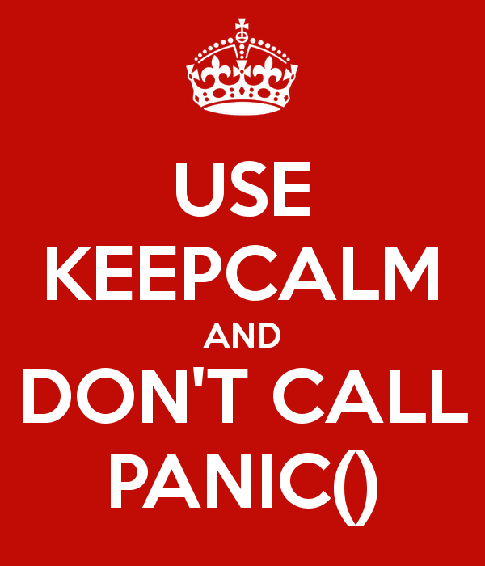

keepcalm is intended to be used as a CI tool to prevent the use of `panic` in
code that should not use `panic`. An example of this is in terraform provider
plugins; Hashicorp's
[
    writing custom providers docs
](
    https://www.terraform.io/docs/extend/writing-custom-providers.html
) say…

   > Functions should _never_ intentionally `panic` or call
   > `os.Exit` - always return an error.

keepcalm does not currently detect calls to `os.Exit` or to functions like
`log.Panic` that call `panic`.